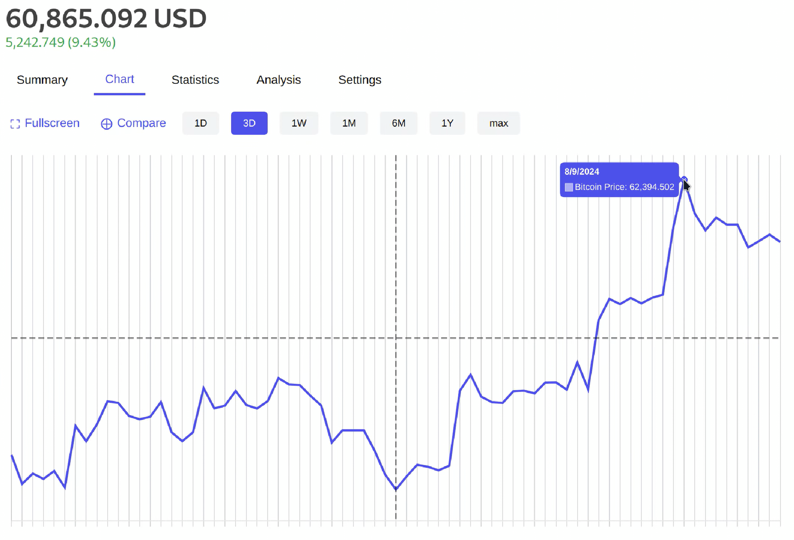

# Price Dashboard

  <div align="center">
    
  </div>


## Overview

This project is a web application that visualizes the price data of Bitcoin.

## Features

- **Responsive Chart**: Displays the Bitcoin price over various time ranges (1D, 3D, 1W, 1M, 6M, 1Y, max).

- **Dynamic Data Fetching**: Fetches real-time price data from the **CoinGecko API**.

- **Interactive UI**: Includes buttons to switch between different time ranges and tabs for navigating different sections of the dashboard.

## Technologies Used

- **React**: JavaScript library for building user interfaces.
- **Chart.js**: JavaScript library for data visualization.
- **Axios**:
- **CoinGecko API**: Public API used to fetch cryptocurrency market data.

## Setup Instructions

### Prerequisites

- Node.js
- npm

### Installation

1. **Clone the repository:**

   ```
   git clone git@github.com:sumedhakoranga/Price_Dashboard.github.io.git
   cd Price_Dashboard
   ```

2. **Install Dependencies and start server**
    ```
    npm install
    npm start
    ```

